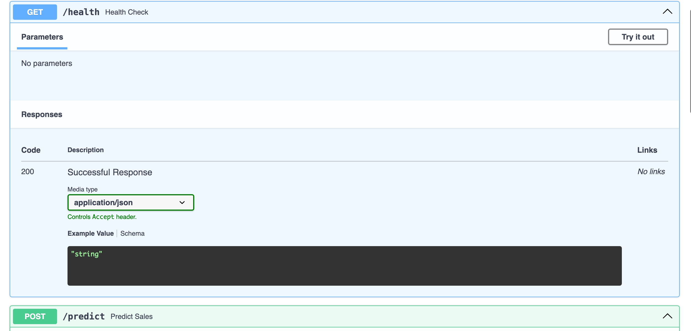
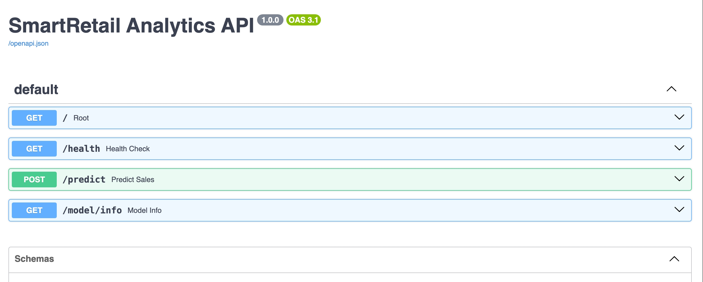

# SmartRetail Analytics

A comprehensive retail analytics solution for sales forecasting and inventory optimization using machine learning.

## 📋 Project Structure

```
smartretail-analytics/
├── README.md               # Project documentation
├── data/                   # Sample data and collection scripts
├── models/                 # Training notebooks and model artifacts
│   └── code.ipynb          # Jupyter notebook for model training
├── deployment/             # Deployment configurations
│   ├── Dockerfile          # Docker configuration
│   ├── requirements.txt    # Python dependencies
│   ├── main.py             # FastAPI application
│   ├── test_api.py         # API test script
│   ├── sales_forecasting_model.joblib  # Trained model
│   ├── feature_columns.json            # Feature columns
│   ├── model_metadata.json             # Model metadata
│   ├── docker-compose.yml  # Docker Compose configuration
│   ├── cloudbuild.yaml     # Cloud Build configuration
│   └── render.yaml         # Render deployment configuration
└── docs/                   # Additional documentation
    ├── api-screenshot-1.jpeg
    └── api-screenshot-2.jpeg
```

## 🚀 Getting Started

### Prerequisites

- Python 3.9+
- Docker
- Azure CLI (for deployment)

### Installation

1. Clone the repository:
   ```bash
   git clone <your-repo-url>
   cd smartretail-analytics
   ```

2. Set up a virtual environment:
   ```bash
   python -m venv venv
   source venv/bin/activate  # On Windows use `venv\Scripts\activate`
   ```

3. Install dependencies:
   ```bash
   pip install -r deployment/requirements.txt
   ```

## 🏃‍♂️ Running Locally

### Start the API
```bash
cd deployment
uvicorn main:app --reload
```

The API will be available at `http://localhost:8000`

## 📚 API Documentation

### Interactive API Documentation
- **Swagger UI**: `http://localhost:8000/docs`
- **ReDoc**: `http://localhost:8000/redoc`

### API Endpoints

#### 1. Health Check
```
GET /health
```
Check if the API is running.

#### 2. Get Model Information
```
GET /model/info
```
Get information about the deployed model.

#### 3. Make Predictions
```
POST /predict
```
Make sales predictions using the trained model.

### API Screenshots

#### Local Development

*Local API documentation and testing interface*

#### Production Deployment

*Production API deployment on Azure Container Instances*

## 🐳 Docker Deployment

### Build the Docker image
```bash
docker build -t smartretail-api -f deployment/Dockerfile .
```

### Run the container
```bash
docker run -d -p 8000:8000 smartretail-api
```

## ☁️ Cloud Deployment

### Azure Container Instances (ACI)
```bash
az container create \
  --resource-group your-resource-group \
  --name smartretail-api \
  --image yourcontainerregistry.azurecr.io/smartretail-api:1.0 \
  --cpu 1 --memory 1.5 \
  --registry-login-server yourcontainerregistry.azurecr.io \
  --registry-username <username> \
  --registry-password <password> \
  --dns-name-label smartretailapi-demo \
  --ports 8000 \
  --location switzerlandnorth \
  --os-type Linux
```

## 📊 Model Information

The sales forecasting model is built using:
- **Algorithm**: Linear Regression
- **Features**: Historical sales data, product categories, promotions
- **Performance**: 98.4% revenue accuracy

## 📝 License

This project is licensed under the MIT License - see the [LICENSE](LICENSE) file for details.

## 🤝 Contributing

Contributions are welcome! Please feel free to submit a Pull Request.
